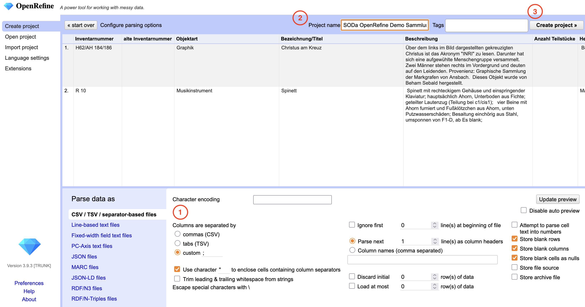
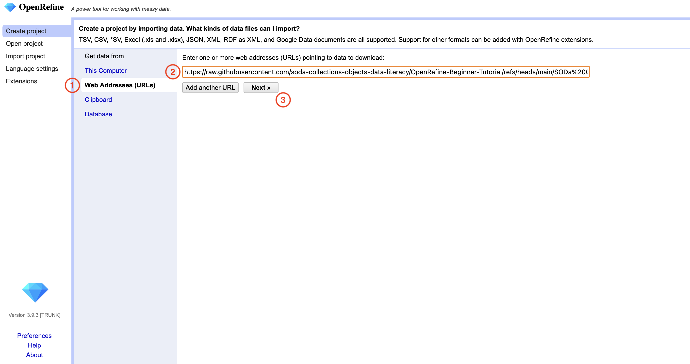
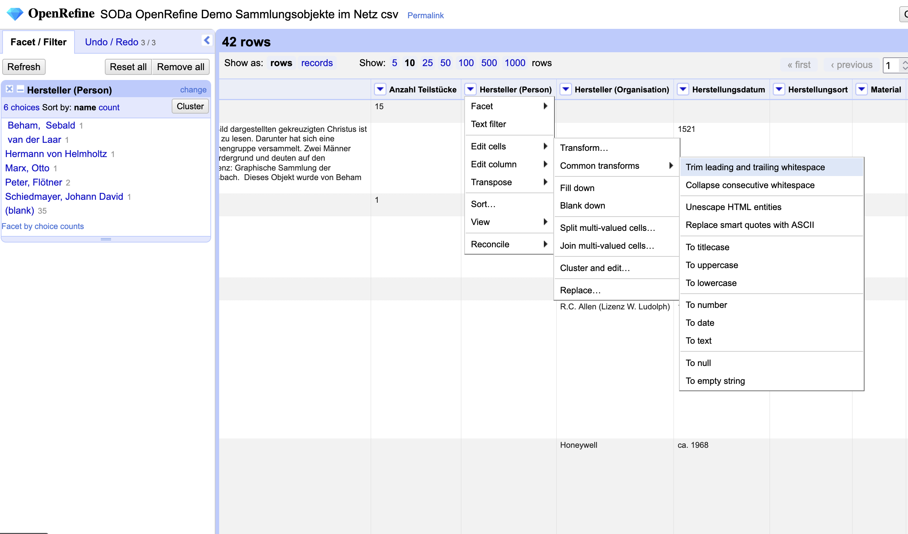
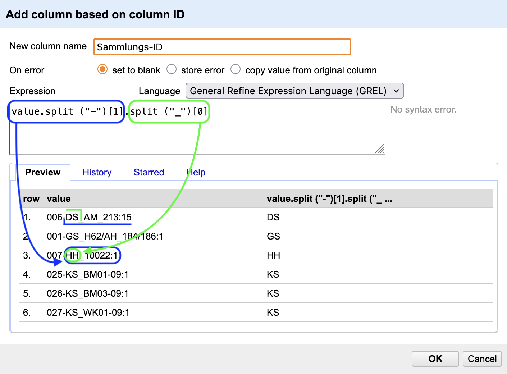
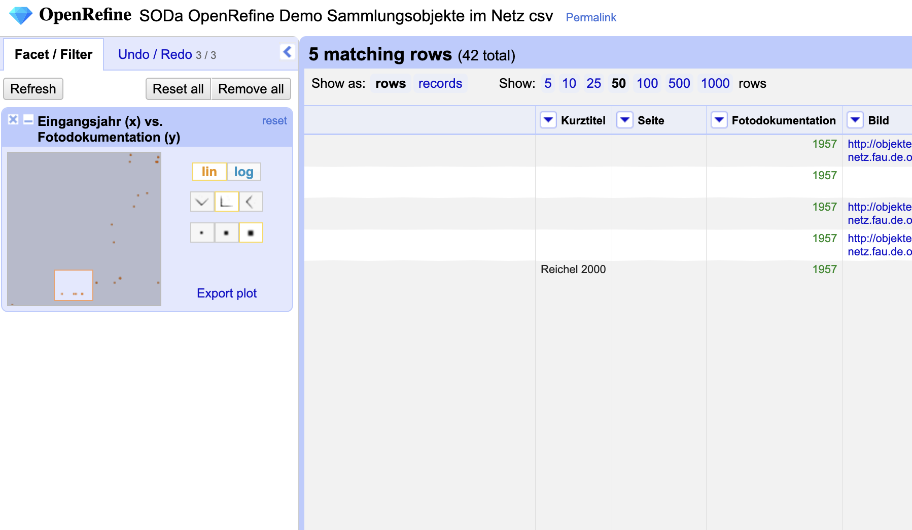
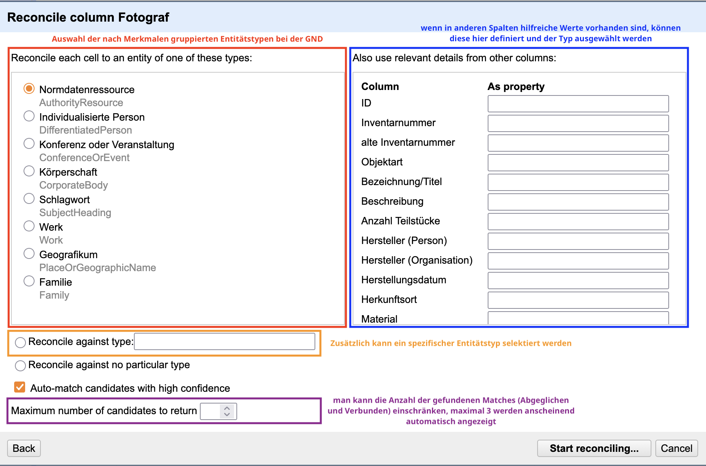

<!--

author:     Louise Tharandt, Johannes Schäffer & Michael Markert
email:      soda@sammlungen.io
date:       2026-09-08
version:    2.1
language:   de
mode:       Textbook
dark:       false

link:       https://cdn.jsdelivr.net/gh/soda-collections-objects-data-literacy/OpenRefine-Beginner-Tutorial@main/theme.css
            https://fonts.googleapis.com/css?family=Noto+Sans

repository: https://github.com/soda-collections-objects-data-literacy/OpenRefine-Beginner-Tutorial 
license:    CC BY 4.0 https://creativecommons.org/licenses/by/4.0/ 

icon:       /img/SODa-Logo_Wort-Bild_RGB.png
logo:       /img/SODa-Logo_Wort-Bild_RGB.png


comment:    Dieses Dokument ist eine Einführung zu OpenRefine v.a. für Personen, 
            die in und mit Universitätssammlungen arbeiten und forschen.

-->

# OpenRefine Einführung

OpenRefine sieht ein wenig aus wie Excel, hat sonst aber wenig Gemeinsamkeiten. Es ist ein leistungsstarkes Open-Source-Tool zur Datenbereinigung und -transformation, das im GLAM-Bereich (Galleries, Libraries, Archives, Museums) und in Universitätssammlungen wertvolle Dienste leistet. Gerade hier, wo heterogene und historisch gewachsene Datensätze oft inkonsistente Metadaten aufweisen, hilft OpenRefine.

Wesentliche Eigenschaften von OpenRefine:

- kann praktisch alle Text-Dateiformate und Datenstrukturen wie CSV, XML, JSON importieren
- kann auf Webseiten und Schnittstellen zugreifen und diese Daten verarbeiten (z. B. für einen Abgleich mit der GND, Wikidata, OpenStreetMap usw.)
- erlaubt einen schnellen Überblick über Dateien mit zehntausenden Zeilen
- ist ideal für Bereinigungs- und Sortieraufgaben, etwa bei dem Import von Daten in ein Museumsdokumentationssystem
- eignet sich deshalb vor allem für wiederholbare, komplexe Bearbeitungsschritte, die ganze Spalten oder die ganze Tabelle betreffen
- und hat dafür eine eigene Skriptsprache namens GREL integriert, es kann aber auch Python genutzt werden
- aber ist für Kalkulation und Diagramme ebenso wenig geeignet, wie die Arbeit an einzelnen Zellen/Feldern – dafür gibt es Excel

Ob zur Vorbereitung digitaler Sammlungen, für Systemmigrationen oder zur besseren Integration in Forschungsinfrastrukturen – OpenRefine erleichtert die Arbeit mit Metadaten erheblich und trägt dazu bei, Sammlungen besser zu erschließen und nachhaltig nutzbar zu machen.

Für einen Überblick zu der Arbeit mit OpenRefine haben wir dieses Tutorial aus unserem SODa Online-Workshop zusammengestellt.

---

## Download und Installation

1. OpenRefine ist ein Open-Source-Tool, das heruntergeladen werden muss: [https://openrefine.org/download](https://openrefine.org/download). Es funktioniert auf allen gängigen Betriebssystemen.

2. Nach dem Download die heruntergeladene Datei durch Doppelklick öffnen, bei Mac in die Applications schieben, bei Windows das .zip file in den Ordner extrahiern, in dem man das Programm haben möchte.

    -> Beim ersten Öffnen kann es passieren, dass ein Warnhinweis erscheint, diesen durch "trotzdem öffnen" ignorieren und Programm starten.

3. OpenRefine öffnet keine eigene Applikation, sondern funktioniert über den eigenen Browser. Dort wird ein neues Fenster automatisch geöffnet und man sieht das User Interface von OpenRefine. Dieses Browser Fenster kann auch durch folgenden Link gefunden werden: [http://127.0.0.1:3333/](http://127.0.0.1:3333/)

4. Erste Daten kann man durch das Klicken des **"Durchsuchen" Buttons** importieren. Dadurch öffnet sich ein neues Fenster, in dem man die Datei auswählen kann. Alternativ kann eine Datei auch in das Datenfenster gezogen werden. Danach wird die Datei durch ein **Klick auf "Next"** geladen.

        -> Online vorhandene Daten können auch per URL in OpenRefine geladen werden, dafür wird in der Spalte ~~Get Data from~~ auf **Web Addresses (URLs)** geklickt, danach kann in das freie Feld die URL kopiert werden.

5. Bevor die Arbeit mit den Daten beginnen kann, wird die geöffnete Datei in OpenRefine dargestellt. Hier können eventuelle Import Fehler, wie (1) Spalten-Separator oder Character encoding, verändert werden. Auch der (2) Projekt Name kann angepasst oder verändert werden. Ist alles korrekt, kann nun oben rechts in der Ecke (3) mit **"create project"** das OpenRefine Projekt gestartet werden.



> ⚠️ Wenn es trotz problemlosem Herunterladen und Öffnen nicht möglich ist Daten hochzuladen, OpenRefine komplett schließen und wieder öffnen.

> 💡 Es besteht die Möglichkeit die Sprache von OpenRefine in der äußersten linken Spalte unter **Language settings** zu ändern, am besten wäre aber die Nutzung von Englisch, da dann mögliche Probleme besser in den internationalen Foren besprochen und behoben werden können.

---

## Demo-Datensatz

Für die Übungen wird folgender Datensatz benötigt:

**Sammlungsobjekte-Demo:**

Der Datensatz stammt aus dem Demosystem von [Objekte im Netz](https://objekte-im-netz.fau.de/oindemo/), einem vom BMBF geförderten Projekt für eine gemeinsame Erschließungs- und Digitalisierungsstrategie für die Sammlungen der Friedrich Alexander Universität Erlangen-Nürnberg.

**~~Diese Daten wurden für unseren Demo Datensatz angepasst und abgeändert~~** und können [hier](https://github.com/soda-collections-objects-data-literacy/OpenRefine-Beginner-Tutorial/blob/main/SODa%20OpenRefine-Demo_Sammlungsobjekte-im-Netz.csv) in unserem Repository heruntergeladen werden. Rechts über dem Code auf das Download Symbol ↓ klicken.

Die einfachste Möglichkeit die Demo-Daten in OpenRefine zu laden, ist das Importieren des Demodatensatz über eine URL (siehe Abbildung 2). Dafür nach dem Öffnen von OpenRefine in der blau hinterlegten linken Spalte auf (1) **Web Addresses (URL)** gehen und dort dann (2) folgenden Link hineinkopieren: https://raw.githubusercontent.com/soda-collections-objects-data-literacy/OpenRefine-Beginner-Tutorial/refs/heads/main/SODa%20OpenRefine-Demo_Sammlungsobjekte-im-Netz.csv

Auf (3) Next klicken, eine Vorschau der Daten (siehe Punkt 5 bei Download und Installation) sollte danach erscheinen.



## Basics

Diese ersten Basic Übungen stellen einige der wichtigsten Anwendungsfälle in OpenRefine dar. Jeder Schritt in OpenRefine hat meistens mehrere Wege, um zum gleichen Ergebnis zu kommen. Jede Person findet den für sie passenden Weg, diese Beispiele sollen als erste Einführung in OpenRefine gesehen werden und den Weg für die zukünftige Nutzung als Tool für die Datenbereinigung, und -transformation aber auch Datenabgleich und -bereicherung ebnen.

Inhaltsübersicht:

1. Reihenfolge des Namens abgleichen und korrigieren
2. Leerzeichen suchen, finden und löschen
3. Sortieren und filtern
4. Undo / Redo
5. URLs auftrennen und korrigieren
6. Clustern von Begriffen zur Vereinheitlichung von Schreibweisen
7. ID/Inventarnummer aus einer Spalte in mehreren aufteilen
8. Messwerte aus einer Spalte in mehreren aufteilen
9. Einfache Datenvisualiserung in OpenRefine
10. Koordinaten zu Ortsnamen aus OpenStreetMap holen
11. Reconciling in OpenRefine
12. Export als Tabellendaten

### 1. Reihenfolge des Namens abgleichen und korrigieren

In einigen Datentabellen kann es vorkommen, dass Namen falsch oder verdreht eingetragen wurden. Mit den folgenden Schritten kann dies in OpenRefine korrigiert werden.

        {{1}}

> Spalte: Bearbeiter -> Facet -> Text Facet

- Nach rechts über die Tabelle scrollen bis die **Spalte "Bearbeiter"** zu sehen ist (kurz nach der Spalte Bild mit blau hervogehobenen Links).
- Dort dann rechts oben das kleine blaue Dreieck 🔽 neben dem Spaltennamen klicken.
- **Facet** wird an erster Stelle des Dropdowns erscheinen, über **Facet** dem nächsten Dropdown nach rechts folgen und **Text Facet** auswählen.
- Auf der linken Seite des Fensters wird nun in der Spalte ein Fenster erscheinen, dieses **"Facet-Fenster"** zeigt den Inhalt der kompletten Spalte mit der jeweiligen Anzahl, also wie oft der Inhalt dort erscheint.  
- In diesem Fenster können jetzt die Namen verglichen und Fehler gefunden werden.

        {{2}}

> edit -> apply

- Innerhalb des kleinen **Facet-Fensters** mit der Maus über Jennifer Höhne schweben und auf `edit` klicken
- Reihenfolges des Namens ändern, auf `apply` clicken

        {{3}}

weitere Möglichkeit:

> include -> edit -> apply

- Runterscrollen zu Wurst, Wurst, Hans und auf den Namen klicken
- Beide Zeilen sind rechts im großen Fenster nun sichtbar
- Mit der Maus über Wurst, Hans schweben und auf der rechten Seite auf include clicken
- alle drei Zeilen sind nun im großen Fenster sichtbar ausgewählt
- innerhalb der Tabelle mit der Maus über Wurst, Wurst, Hans schweben und auf edit klicken
- den doppelten Nachnamen löschen, auf Apply to all identical cells klicken
- die Korrektur ist nun in beiden Fenstern sichtbar, im Facet Fenster ist eine 0 hinter Wurst, Wurst, Hans zu sehen
- um wieder alle Zeilen zu sehen, auf die orange markierten Namen klicken oder im kleinen Fenster oben rechts auf reset
- Facet Fenster schliessen, oben links auf 🆇

---

### 2. Leerzeichen suchen, finden und löschen

        {{1}}

> Spalte "Bezeichnung/Titel" -> Facet -> Text Facet

- Wieder wie im ersten Beispiel über die Tabelle scrollen bis die **Spalte "Bezeichnung/Titel"** zu sehen ist (diesmal nach links fast bis zum Anfang). Rechts oben das kleine blaue Dreieck 🔽 neben dem Spaltennamen klicken. Über **Facet** dem nächsten Dropdown nach rechts folgen und **Text Facet** auswählen.
- Innerhalb des kleinen Facet-Fensters sieht man an erster Stelle nur eine graue 1, darunter die korrekten Bezeichnungen
- Beim Anklicken der Auswahl (direkt links neben der Zahl 1, teilweise schwer zu finden) wird die Zeile im großen Fenster rechts angezeigt
- In der Spalte "Bezeichnung/Titel" auf `edit` klicken
- Es zeigt sich farblich hervorgehoben, dass dort ein Leerzeichen gesetzt war
- Leerzeichen löschen und `apply` drücken
- Im kleinen Facet Fenster oben in der Mitte / links von Remove all auf `reset all` klicken, die Auswahl ist wieder zurückgesetzt

        {{2}}

> Spalte "Hersteller (Person)" -> Facet -> Text Facet

- Zur Spalte **"Hersteller (Person)"** scrollen (rechts von "Bezeichnung/Titel")
- Neues **Text Facet** erstellen
- 💡 Wenn in der linken Spalte zu viele Facet-Fenster offen sind und sie nicht mehr genutzt werden, oben links im blauen Balken des kleinen Facet-Fensters auf das 🆇 klicken und das Fenster schließen
- Die ersten beiden Namen sind durch Leerzeichen am Anfang etwas weiter eingerückt

> Spalte "Hersteller (Person)" -> Edit Cells -> Common Transforms => Trim leading and trailing whitespaces

- Damit nicht jedes Leerzeichen per Hand repariert werden muss, kann eine komplette Spalte mit diesem Arbeitsschritt durchsucht und repariert werden
- Es werden alle Leerzeichen an Anfang und Ende eines Wortes oder Satzes in allen Feldern dieser Spalte gelöscht
- In der Spalte auf das blaue Dreieck klicken und auf **Edit Cells** gehen, dort dann mit der Maus auf **Common Transforms** rutschen und beim danach aufgehenden Feld auf **Trim leading and trailing whitespaces** klicken.



> Spalte "Hersteller (Person)" -> Edit Cells -> Common Transforms => Collapse consecutive whitespaces

- In diesem Arbeistschritt werden alle aufeinander folgenden Leerzeichen (bspw. zwei hintereinander) gelöscht
- In der Spalte auf das blaue Dreieck klicken und auf **Edit Cells** gehen, dort dann mit der Maus auf **Common Transforms** rutschen und beim danach aufgehenden Feld auf **Collapse consecutive whitespaces** klicken.

        {{3}}

> Spalte "All" -> Edit all columns -> Trim leading and trailing whitespaces... Spalte "All" -> Edit all columns -> Collapse consecutive whitespaces...

- Diese soeben durchgeführten Funktionen können auch über alle Spalten hinweg angewendet werden
- In der ersten Spalte **"All"** das Dropdown Menü aufrufen und über **Edit all columns** alle Leerzeichen an Anfang und Ende löschen (**Trim leading and trailing whitespaces...**) und / oder alle aufeinander folgenden Leerzeichen löschen (**Collapse consecutive whitespaces...**)

💡 Tipp: Am Anfang eines Projektes kann man nach dem Auswählen des Datensatzes bevor man das Projekt in OpenRefine erstellt ein Häkchen unten links bei Trim leading & trailing whitespace from strings machen.

---

### 3. Sortieren und filtern

        {{1}}

> Spalte "Objektart" -> Sort ...

- Zur Spalte **"Objektart"** scrollen (links von "Bezeichnung/Titel")
- Rechts oben das kleine blaue Dreieck 🔽 neben dem Spaltennamen klicken und zu **Sort...** gehen. 
- Text und Sortierung a-z ausgewählt lassen
- Auf der rechten Seite das Feld "blanks" nach oben ziehen
- Auf OK klicken
- Die Zeilen sind nun sortiert, so dass in der Spalte "Objektart" leere Felder zuerst angezeigt werden und danach nach dem Alphabet die Felder sortiert sind
- Anhand der **"All"** Spalte ist sichtbar, dass die Sortierung Auswirkung auf die ganze Tabelle hat und die Zeilen auch für die restlichen Spalten geändert sind

        {{2}}

> Spalte "Objektart" -> Text filter

- Im Dropdown direkt unter Facet ist die Option für **Text filter** zu finden
- In der linken Spalte erscheint ein Suchfeld
- *Kreisel* eingeben
- Alle Zeilen mit dem Wort Kreisel in der Spalte "Objektart" sind jetzt im großen Fenster zu sehen
- Um den Filter zu löschen, im Suchfeld auf reset klicken oder beim Suchfenster links oben auf 🆇 drücken

        {{3}}

> Spalte "Objektart" -> Sort ... -> Remove sort

- Die Sortierung ist weiterhin noch vorhanden
- Um die Sortierung aufheben im Dropdown Menü zu **Sort** gehen und im darauf erscheinenden Dropdown **Remove sort** auswählen

💡 Tipp: oben in der Zeile, in der man die Anzahl an zu sehenden Reihen sieht, kann man die Sort Option auch ändern

        {{4}}

> Spalte "ALL" -> Facet -> Blank records per column

- Hier werden alle Spalten nach leeren Zellen überprüft
- Im Facet Fenster in der linken Spalte sind nun alle Spalten aufgelistet, sortiert nach Namen
- um eine bessere Übersicht über die Anzahl der leeren Felder bzw. Zellen zu bekommen, oben im Facet neben ~~73 choices Sort by:~~ von **name** auf **count** wechseln
- alle Spalten mit einer grauen 42 hinter der Bezeichnung sind somit komplett leer
- diese Sortierung gibt einem auch eine schnelle Übersicht, in welchen Spalten nur wenige Werte eingetragen sind

---

### 4. Undo / Redo

        {{1}}

- Jeder durchgeführter Schritt in OpenRefine wird aufgezeichnet.
- Man muss nicht zwischendurch speichern und verliert keine Daten oder Änderungen an den Daten.
- Links im Seitenfenster sind die Facets zu sehen, diese sind sichtbar, da aktuell und in der Standardansicht der Tab **Facet / Filter** angezeigt wird.
- oben (direkt unter dem OpenRefine Logo, über das man wieder in die Projektauswahl kommt) kann der Tab gewechselt werden zu **Undo / Redo**
- Hier in der Liste sind alle durchgeführten Schritte und Änderungen gespeichert.
- Man kann nun auf einen der Schritte klicken und somit "zurückspringen" bzw. die danach folgenden Änderungen rückgängig machen.
- Aber ⚠️ durch neue Änderungen kann auf die zuvor rückgängig gemachten Schritte nicht mehr zugegriffen werden.
- Wenn die durchgeführten Schritte auf andere Daten übertragen werden sollen, kann der komplette Verlauf oder ein Teil davon, also die durchgeführten Schritte, exportiert werden: Im Seitenfenster oben rechts auf **Extract...** gehen und dann über Export speichern.
- Diese JSON Datei kann dann beispielsweise in einem neuen Projekt innerhalb des **Undo / Redo** Tabs über den **Apply...** Button hineingeladen werden.

---

### 5. URLs auftrennen und korrigieren

        {{1}}

> Spalte "Bild" -> Edit cells -> Split multi-valued cells

- Mit diesem Beispiel tasten wir uns an Expressions und erste einfache Tricks zum verändern von Inhalten ran
- Die Spalte "Bild" mit allen Links finden und über das Dropdown Menü **Edit cells** und dort dann **Split multi-valued cells** auswählen
- Auswahl bei **"by Separator"** lassen und in das freie Feld folgendes dort genutztes Trennzeichen einfügen und ein **Häkchen** ☑️ bei **regular expression** setzen:

    ` , `
- Auf OK klicken
- Durch diese Aktion sind bei mehrfachen Werten in der Spalte, die in ihrer Zelle durch ein Komma getrennt waren, neue Zeilen entstanden
- Dies kann man bei einem Vergleich durch Auswahl oben links zwischen **rows** (in diesem Fall 48) und **records** (42) sehen

        {{2}}

> Spalte "Bild" -> Edit cells -> Transform...

- Wieder in der Spalte "Bild" über das Dropdown Menü **Edit cells** und dort dann **Transform...** auswählen
- In das farblich hervorgehobene Feld, in dem Value steht, für folgende Funktion einfügen:

`value.replace("%20","")`

- Auf OK klicken
- **Erklärung:** Einige der Links waren fehlerhaft (z.B. Reihe 2, Christus am Kreuz), es wurden maschinenlesbare Leerzeichen eingetragen (%20), die einen Link dadurch falsch weitergeleitet haben. Mit der eingetragenen Funktion haben wir den Value (Wert) Leerzeichen, der in der Klammer durch die zwei Anführungszeichen markiert ist `("%20")` ersetzt und durch die Wegnahme des maschinelesbaren Leerzeichens`("")` den Link wieder zusammengefügt.
- Alle Links wurden erst getrennt, dann konnte die komplette Spalte kontrolliert werden und mit dieser Funktion wurden alle "kaputten Links" in dieser Spalte repariert

        {{3}}

> Spalte "Bild" -> Edit cells -> Join multi-valued cells

- Damit alle Werte wieder zu ihren korrekten Zeilen und IDs passen, müssen die getrennten Werte wieder zusammengebracht werden
- Über das Dropdown Menü **Edit cells** und dort dann **Join multi-valued cells** auswählen
- im Pop-up wird automatisch schon ein Komma angegeben, dies kann so übernommen werden
- Es sind wieder 42 rows und 42 records vorhanden
- Join arbeitet immer pro record, so kommt wieder zusammen, was vorher zusammen war

---

### 6. Clustern von Begriffen zur Vereinheitlichung von Schreibweisen

        {{1}}

> Spalte "Teilsammlung" -> Facet -> Text Facet

- Zur Spalte **"Teilsammlung"** scrollen (etwas nach links scrollen, zwischen Bemerkung und Provenienz (Referenztitel))
- **Text facet** für die Spalte **"Teilsammlung"** erstellen
- Werte kontrollieren und Fehler finden
- Im kleinen Facet Fenster oben rechts auf Cluster drücken
- Im neu geöffneten Fenster keine Änderungen vornehmen und in der Mitte auf Cluster klicken
- Für dieses Beispiel reicht die Cluster Funktion **Fingerprint** noch nicht, es wurden nicht alle Fehler erkannt
- In der Mitte oben bei Keying function die darauffolgenden Funktionen ausprobieren und Unterschiede beobachten
- Keying function "Cologne phonetic" auswählen und auf Cluster drücken
- Alle korrekten Schreibweisen sind nun vorhanden und können angepasst werden
- Dort, wo eine Vereinheitlichung durchgeführt werden soll, ein Häkchen bei Merge setzen und unter **New cell value** die korrekte Schreibweise eintragen
- **Merge selected & Close**
- Alle Begriffe sind nun korrekt vereinheitlicht

---

### 7. ID/Inventarnummer aus einer Spalte in mehreren aufteilen

        {{1}}
> Spalte "ID" -> Edit column -> Add column based on this column ... `value.split(":")[1]`

- Zur Spalte **"ID"** ganz am Anfang scrollen
- Die ID besteht aus verschiedenen Codes, 000 (laufende Nummer) - ABC (Sammlungs-ID) _ XY123 (Signatur) : 123 (Anzahl)
- Für die Spalte "ID" über das Dropdown-Menü **Edit column** und dort dann **Add column based on this column ...** auswählen
- Oben im Feld neuen Spalten Namen einfügen, für dieses Beispiel **Anzahl** eingeben
- Innerhalb des Expression-Feldes folgende Funktion einfügen und OK drücken:

    `value.split(":")[1]`

💡 Warum klappt das? Von vorn zählt man in einem Array [0], [1], [2] usw., von hinten [-1], [-2], [-3].

- Der Wert ist in diesem Fall der Bereich vor oder nach dem Doppelpunkt, 
- also bei `value.split(":")[0]` der erste Bereich -> 006-DS\_AM\_213 
- und bei `value.split(":")[1]` der zweite Bereich -> 15.

        {{2}}
> Spalte "ID" -> Edit column -> Add column based on this column ... `value.split ("-")[1].split ("_")[0]`

- Bei Spalte "ID" bleiben und über das Dropdown-Menü **Edit column** und dort dann **Add column based on this column ...** auswählen
- Oben im Feld neuen Spalten Namen einfügen, für dieses Beispiel **Sammlungs-ID** eingeben
- Innerhalb des Expression-Feldes folgende Funktion einfügen und OK drücken:

    `value.split ("-")[1].split ("_")[0]`

- Der Wert (value) wird in diesem Fall noch spezifischer gewählt, 
- beim ersten gesuchten Zeichen, dem Bindestrich `("-")` wird das zweite Array [1] gewählt 
- und direkt auf dem Ergebnis aufbauend wird beim zweiten gesuchten Zeichen, dem Unterstrich `("_")` das erste Array [0] gewählt. 



        {{3}}
> Spalte "ID" -> Edit column -> Add column based on this column ... `?`

- Bei Spalte "ID" bleiben und über das Dropdown-Menü **Edit column** und dort dann **Add column based on this column ...** auswählen
- Oben im Feld neuen Spalten Namen einfügen, für dieses Beispiel **Signatur** eingeben
- Hier wollen wir den Bereich nach der **Sammlungs-ID** und vor der **Anzahl** herauslösen und in einer neuen Spalte darstellen.

> **Frage:** Wie lautet die Funktion?

```  -Lösung
value.split ("_")[1].split (":")[0]

Auch hier wird der Wert (value) wieder spezifischer gewählt, 
beim ersten gesuchten Zeichen, dem Unterstrich ("_"), wird das zweite Array [1] gewählt 
und direkt auf dem Ergebnis aufbauend wird beim zweiten gesuchten Zeichen, 
dem Doppelpunkt (":"), das erste Array [0] gewählt.
```

---

### 8. Messwerte aus einer Spalte in mehreren aufteilen

        {{1}}

> Spalte "Messung" -> Facet -> Text Facet

- Zur Spalte **"Messung"** nach rechts scrollen (zwischen Technik und Eingangsjahr)
- Man kann schnell erkennen, dass in der Spalte "Messung" alle Werte eingetragen wurden, ohne auf Reihenfolge oder Typ zu achten
- Als Vorarbeit für den nächsten Schritt die Werte an 2. Position (H.: 17cm, Dm.: 13cm) korrigieren und anpassen (Höhe: 17cm, Durchmesser: 13cm)
- Wenn die Schritte zur Korrektur der Werte fehlen, auf die Lösung klicken und öffnen:

```  -Lösung
Im kleinen Facet Fenster über H.: 17cm, Dm.: 13cm hovern, 
sodass die Zeile grau hervorgehoben ist. 
Nach rechts zu edit gehen und auswählen. 
Zu Höhe: 17cm, Durchmesser: 13cm ändern und auf Apply klicken. 
-- Oder --
Im kleinen Facet Fenster auf H.: 17cm, Dm.: 13cm klicken, 
die Zeile erscheint nun im großen Fenster. 
In der Spalte rechst neben dem Wert auf das blau aufleuchtende edit klicken 
und Wert Höhe: 17cm, Durchmesser: 13cm ändern und auf Apply klicken. 
Im Facet Fenster rechts oben auf reset drücken.

Korrekturen erfolgreich durchgeführt.
```

        {{2}}

> Spalte "Messung" -> Edit column -> Add column based on this column ...

- Über das Dropdown Menü **Edit column** und dort dann **Add column based on this column ...** auswählen
- Oben im Feld neuen Spalten Namen einfügen, für dieses Beispiel **Länge** eingeben
- Innerhalb des Expression Feldes folgende Funktion einfügen und OK drücken:

    `value.find(/Länge:\s*\d+(,\d+)?(mm|cm)/)[0]`

**Erklärung:**

| Expression | Bedeutung |
| -----------|------------|
| Länge:     | Sucht den genauen Text „Länge:“ |
| \s*        | Erlaubt beliebig viele Leerzeichen (oder keine) nach „Länge:“ |
| \d+        | Erfordert mindestens eine Ziffer (ganze Zahl wie 12, 456 usw.) |
| (,\d+)?    | Optional: Ein Komma gefolgt von einer weiteren Zahlenfolge (z. B. ,45 für Dezimalzahlen) |
| (mm\|cm)    | Erwartet, dass der Text mit "mm" oder "cm“ endet |

- Aus der Spalte "Messung" wurden nur die Längenangaben extrahiert, dies kann man durch austauschen der Wörter mit den Angaben für Breite, Höhe und Durchmesser wiederholen.

- Um die Spalte **Gewicht** zu erstellen die Schritte wiederholen und folgende Funktion einfügen:

    `value.find(/Gewicht:\s*\d+(,\d+)?(g|kg)/)[0]`

        {{3}}

>**Frage:** Wenn die Spalte Breite erstellt werden soll, wie lautet die Funktion?

```  -Lösung
value.find(/Breite:\s*\d+(,\d+)?(mm|cm)/)[0]
```

---

### 9. Einfache Datenvisualiserung in OpenRefine

Für eine kurze Übersicht können vor allem Zahlen und Datumsangaben in OpenRefine vereinfacht visualisiert werden. Je nach Datenlage können eine Histogram oder eine Scatterplot Darstellung erstellt werden.

        {{1}}

> Spalte "Fotodokumentation" -> Edit cells -> Transform...

- Zur **Spalte "Fotodokumentation"** gehen (drei Spalten hinter Messung), rechts oben das kleine blaue Dreieck 🔽 neben dem Spaltennamen klicken.
- Auf **Edit Cells** und gleich weiter zu **Transform...** rutschen und dann folgende Expression eingeben:

`value.toDate('dd.MM.yyyy','dd-MM-yy').toString('yyyy-MM-dd')`

- Dadurch sind die verschieden eingetragenen Werte aufgeräumt 

        {{2}}

> Spalte "Fotodokumentation" -> Facet -> Timeline Facet

- Diese könnten nun auch als Datumswerte definiert werden:
- Auf **Edit Cells** und gleich weiter zu **Common transforms** und dort weiter zu **To date** 
- Die Werte werden nun als Datumstyp angezeigt, diese kann man in einer Timeline darstellen
- Hierfür rechts oben das kleine blaue Dreieck 🔽 neben dem Spaltennamen klicken und über **Facet** auf **Timeline facet** gehen
- In der linken Spalte wird nun ein Timeline facet dargestellt
- In dieser Timeline können links und rechts die "Griffe" verschoben werden, dadurch wird die Auswahl innerhalb des Zeitstrahls vergrößert oder verkleinert
- Durch die Visualsierung können Ausreißer und auch die zeitliche Verteilung der Daten besser und übersichtlicher angezeigt werden

        {{3}}

> Spalte "Fotodokumentation" -> Edit column -> Add column based on this column...

- um die Jahreszahlen mit anderen Zahlen vergleichen zu können, müssen wir diese erst wieder vom Valuetyp Datum zum Valuetyp Zahl umwandeln
- da wir unsere Spalte nicht ändern und die Datumswerte verlieren wollen, erstellen wir eine neue Spalte für die Jahreszahlen
- über **Edit column** und **Add column based on this column...** kommen wir wieder zu den Expressions
- hier wird nun einen Titel (Jahr Fotodokumentation) und folgende Funktion eingegeben:

`value.split("-")[0].toNumber()`

- hierbei wird definiert, dass der Wert Jahr erst abgetrennt wird und daraus eine Zahl (number) als Value Type definiert wird
- mit dieser Umwandlung kann nun die nächste Visualisierung kommen

        {{4}}

> Spalte "Eingangsjahr" -> Facet -> Scatterplot Facet...

- die Daten der **Spalte "Eingangsjahr"** sollen mit den Daten der **Spalte "Jahr Fotodokumentation"** verglichen werden
- dafür müssen noch die Werte aus der Spalte Eingangsjahr zu Zahlenwerten umgewandelt werden. Für die Spalte etwas nach links scrollen, zwischen Messung und Beschreibung/Transkription
- Auf **Edit Cells** und gleich weiter zu **Common Transforms** rutschen und dann auf **To number** klicken
- Jetzt oben bei **Spalte "Eingangsjahr"** und dort über **Facet** zu **Scatterplot Facet...** gehen
- Ein Fenster mit einem Scatterplot öffnet sich, hier kann man zwischen linearem oder logarithmischen Plot wählen, die Anordnung der Achsen und auch die größe der Punkte wählen
- wenn man auf die Plotdarstellung klickt, wird dieser Scatterplot in der Facet Seitenleiste dargestellt
- hier kann man mit der Maus im Scatterplot einen Bereich markieren, in dem man an einer Stelle klickt und die Maus dann in irgendeine Richtung zieht
- das daraus entstehende Rechteck ergibt das Feld der Auswahl
- damit können bestimmte Punkte oder auch Ausreißer markiert und herausgesucht werden



💡 im Plot in der Seitenleiste können die Einstellungen noch geändert werden

⬇️ der Plot kann von dort wenn gewünscht auch exportiert werden


---

### 10. Koordinaten zu Ortsnamen aus OpenStreetMap holen

        {{1}}

- Für die Spalte "Herstellungsort" über das Dropdown-Menü **Facet**, darin **Customized facets** und dort **Facet by blank (null or empty string)** auswählen.
- Am linken Rand nun **false** wählen, um alle nicht-leeren Felder der Spalte anzuzeigen.
- Nun für die Spalte im Dropdown-Menü **Edit column** und darin **Add column by fetching URLs** auswählen.
- Für die neue Spalte den Namen "OSM" angeben. Das **Throttle delay** sollte "1000" (ms) betragen.
- In das Expression-Feld folgende Funktion einfügen und OK drücken:

    `"https://nominatim.openstreetmap.org/search?q=" + value.escape('url') + "&format=jsonv2&limit=1"`

> ⚠️ Hinweis: Der Nominatim-Dienst von OpenStreetMap ist ein kostenloses Angebot, dass man nicht zu intensiv nutzen sollte, eventuell wird sonst die eigene IP-Adresse dafür gesperrt, s. https://operations.osmfoundation.org/policies/nominatim/ Der Abstand zwischen Abfragen sollte daher mindestens 1 Sekunde betragen, was im "Throttle delay" festgelegt wird.

> ⚠️ Der Dienst kann in manchen Fällen nicht funktionieren, nach ein oder zwei erneuten Versuchen sollten aber die Ergebnisse in der neuen Spalte zu sehen sein.

> 💡 Im Ausdruck selbst wird `value.escape('url)` verwendet, damit Umlaute, Leer- und Sonderzeichen in den Ortsnamen so umgewandelt werden, dass eine gültige URL entsteht.

- Als Antwort liefert der Nominatim-Dienst JSON-Dokumente, aus denen die entsprechenden Koordinatenwerte noch herausgeparst werden müssen.

- Für die Spalte "OSM" über das Dropdown-Menü **Edit column** und dort dann **Add column based on this column ...** auswählen
- Oben im Feld neuen Spalten Namen einfügen, für dieses Beispiel **Lat, lon** eingeben
- Innerhalb des Expression-Feldes folgende Funktion einfügen und OK drücken:

    `parseJson(value)[0].lat + ", " + parseJson(value)[0].lon`

---

### 11. Reconciling in OpenRefine

        {{1}}

- Mit Reconciliation wird in OpenRefine eine Datenanreicherung durch Abgleich von Daten über externe Services beschrieben.
- In diesem Beispiel führen wir den Abgleich mit dem Service von Wikidata und dem GND Service von lobid durch.

> Spalte "Fotograf" -> Reconcile -> Start reconciling...

- Um das Reconciling durchzuführen, muss ein Service ausgewählt werden.
- WikiData ist schon in OpenRefine integriert, die Verbindung zur GND muss erst eingerichtet werden.
- In der Spalte **"Fotograf"** oben das kleine blaue Dreieck 🔽 neben dem Spaltennamen klicken und an letzter Stelle über **Reconcile** auf **Start reconciling...** gehen
- Wenn das Reconcile Fenster sich öffnet, unten links auf **Add Standard Service...** klicken.
- Dort dann folgende URL eingeben / hineinkopieren: https://lobid.org/gnd/reconcile/
- Aus der Liste der Reconciling Services **GND reconciliation for OpenRefine** wählen und unten rechts auf **Next** klicken.
- Für diese Übung kann alles beibehalten und einfach unten rechts **Start reconciling...** ausgewählt werden.
- In Abb. 6 werden die einzelnen Felder des Reconciling Fensters erklärt.



        {{2}}

- Nach wenigen Sekunden werden die vorhandenen Namen der Fotografen mit den in der GND vorhandenen Namensdaten verbunden sein.
- Übereinstimmende Werte sind dunkelblau gekennzeichnet, bei Werten, die noch nicht eindeutig zuzuweisen waren, ist eine Auswahl aus hellblauen Namen zu sehen.
- Durch das Anklicken der hell- und auch dunkelblauen Werten, wird ein neues Fenster mit den Informationen in der GND geöffnet.
- Hierdurch können und sollten die abgeglichenen und verbundenen Werte kontrolliert werden.
- Bei nicht eindeutig zugewiesenen Werten kann, wenn die Maus über dem Namen liegt, der richtige Wert festgelegt werden. Um einen einzelnen Wert festzulegen auf **Match this cell** oder auf den Button mit einem einzelnen Haken klicken. Um den richtigen Wert, der in mehreren Zeilen vorhanden ist, festzulegen, auf **Match all identical cells** oder auf den Button mit zwei Haken klicken.
- Dies bei List, Herbert (an zweiter Stelle: Fotograf; Kunstsammler) und Blum, Dieter (an erster Stelle: Fotograf) durchführen.
- In manchen Fällen ist die korrekte Zuweisung in den vorgeschlagenen GND Werten nicht zu sehen. Unter den Vorschlägen steht hellblau und klein **See more**, dies erweitert die Liste an vorgeschlagenen GND Vergleichswerten. Unter **Search for match** werden die Vorschläge aufgelistet, man kann aber auch spezifisch noch mal suchen. Also beispielsweise in das Suchfeld die GND Nummer eintragen, wenn man diese vorher recherchiert hat. Man kann hier aber auch auf **Don't reconcile cell** gehen, dadurch wird der Wert nicht mit der GND verbunden, falls dies nicht möglich oder gewollt ist.

        {{3}}

> Spalte "Fotograf" -> Edit column -> Add columns from reconciled values...

- Wenn Werte einer Spalte mit der GND (oder einem anderen Service) abgeglichen und verbunden sind, können die in der Datenbank / dem Service vorliegenden Daten in OpenRefine geladen / kopiert werden.
- Über den bekannten Weg, das blaue Dreieck zu **Edit column** gehen und dort dann weiter zu **Add columns from reconciled values...**
- In dem geöffneten Fenster können nun aus allen GND Properties die Informationen in einer neuen Spalte dargestellt werden. Dafür auf die gewünschte Eigenschaft klicken, auf der rechten Seite werden die Informationen angezeigt. Man kann durch die Liste scrollen oder oben links in das Suchfeld nach Properties suchen.
- In diesem Fall folgende Properties auswählen: GND-Nummer, Geburtsdatum, Sterbedatum, Geburtsort
- Bei den Spalten auf der rechten Seite kann man auch sehen, dass die Spalten dort auch wieder gelöscht werden können, wenn diese doch nicht erwünscht sind.
- Unten rechts auf **ok** gehen und innerhalb kurzer Seite sind die neuen Spalten und die aus der GND kopierten Informationen zu sehen.
- Auch von den neu entstandenen Spalten, kann wieder neu reconciled werden, also kann nun beispielsweise die Spalte Geburtsort gewählt werden und die vorhin durchgeführten Schritte (-> Edit column -> Add columns from reconciled values...) können wiederholt und neue Informationen in die Tabelle eingepflegt werden.

> 💡 Weitere Reconciling Services können über den Button **Discover services...** oder unter folgendem Link eingesehen werden: https://reconciliation-api.github.io/testbench/0.2/#/ 

> ⚠️ Eine Spalte, die erst mit einem Service und dann mit einem anderen Service reconciled wird, verliert die Verbindung zum davor genutzten Service. Das heißt, wenn erst GND und dann WikiData genutzt wurden, ist die Spalte nur noch mit WikiData verbunden. Um beides zu nutzen, sollte die Spalte vorher dupliziert werden (**Edit column** und dort dann **Add column based on this column ...**, neuen **Spaltennamen** eingeben, sonst nichts ändern, auf **ok**).

> 💡 Wenn über WikiData reconciled wird und über **Add columns from reconciled values...** in einer neuen Spalte die Q-Nummer bzw. ID angezeigt werden soll, ist das Property nicht in der Auswahlliste zu finden. Hierfür auf das blaue Dreieck zu **Reconcile** gehen und dort dann weiter zu **Add entity identifiers column...** gehen. Einen passenden Spaltennamen eingeben und die zum Wert gehörige ID wird in der neuen Spalte zu sehen sein.


---

### 12. Export als Tabellendaten

        {{1}}

- Rechts oben über dem blauen Rahmen auf "Export" klicken
- Das Dropdown Menü lässt einen dann das Format wählen, z. B.:

  - "Comma-separated value (.csv)" für möglichst universelle Weiterverarbeitung (kann Probleme mit Umlauten und Sonderzeichen in Excel geben)
  - "Excel (.xls)" wenn es in gängigen Tabellenkalkulationen möglichst reibungslos funkionieren soll
  - "Custom tabular" wenn man genau einstellen möchte, welche Spalten in welcher Zeichenkodierung und mit welchen Trennzeichen in welches Zielformat exportiert werden sollen

---

## weiterführende Ressourcen und Links

In diesem Kapitel sind die wichtigsten Links und weiterführende Tutorials zu finden:

- Dokumentation
- Einsteiger Tutorials
- Clustering
- GND-Abgleich
- Batch-Upload
- Web Daten
- Regex und GREL

### Dokumentation

> [Offizielle Dokumentation (Englisch)](https://openrefine.org/docs)

Hier können alle wichtigen Schritte in OpenRefine nachgeschlagen werden, die Dokumetation ist auf Englisch, kann aber innerhalb des Browsers (wenn möglich) übersetzt werden.

Es ist allgemein wahrscheinlich einfacher, die Spracheinstellung bei OpenRefine auf Englisch zu lassen, somit lassen sich Probleme und Fragen einfacher lösen. Die Community von OpenRefine ist groß und viele Fragen und Antworten können im [OpenRefine Forum](https://forum.openrefine.org/) gefunden werden.

### Einsteiger Tutorials

- Einsteigerworkshop (Deutsch): https://fdmlab.landesarchiv-bw.de/workshop/openrefine-einsteiger/warum-openrefine/
- Einsteigerworkshop (Englisch): https://evanwill.github.io/openrefine-b/content/0-refine.html
- Einsteigerworkshop als Video (Englisch): https://www.youtube.com/watch?v=yTJ6x6zEQmI
- Einsteiger YouTube Tutorial (Deutsch): https://www.youtube.com/watch?v=E5QgxZ4l6ac
- Einsteiger YouTube Tutorial (Englisch): https://www.youtube.com/watch?v=sAS0_RQSmms

### Clustering

Algorithmische Suche von ähnlichen Begriffen, die dann durch einen Begriff ersetzt werden können – etwa bei Tippfehlern

- Tutorial (Deutsch): https://fdmlab.landesarchiv-bw.de/workshop/openrefine-einsteiger/05-clustering/
- Dokumentation (Englisch): https://openrefine.org/docs/technical-reference/clustering-in-depth
- bei Key collisions sind die phonetisches Verfahren Metaphone3 meist für englische Sprache, Cologne Phonetics für deutsche Sprache, Daitch-Moktoff für Jiddisch und slawische Sprache, Beider-Morse für alle Sprachen

### GND-Abgleich

- Tutorial (Deutsch): https://fdmlab.landesarchiv-bw.de/workshop/openrefine-einsteiger/06-reconciling-mit-gnd/
- Hier ein Tutorial mit einem Beispiel-Workflow zur Bereinigung von Ortsnamen, bei denen Clustering und GND-Abgleich zum Einsatz kommen (Deutsch): https://www.youtube.com/watch?v=tCdluPq5GkA&t=615s

### Batch-Upload

von Daten zu Wikimedia Commons

- Video (Englisch): https://www.youtube.com/watch?v=sc6aNNmsNCI

### Web Daten

Mit OpenRefine Daten aus dem Web laden und verarbeiten

- Turorial (Englisch): https://programminghistorian.org/en/lessons/fetch-and-parse-data-with-openrefine

### Regex und GREL

- in der OpenRefine Dokumentation (Englisch): https://openrefine.org/docs/manual/expressions
- zum Testen der Expressions (Englisch): https://regex101.com/
- und auch zum Testen und Lernen (mit Cheat Sheet) (Englisch): https://regexr.com/
- Regex Übung (Deutsch): https://fdmlab.landesarchiv-bw.de/workshop/openrefine-fortgeschrittene/08-regulaere-ausdruecke/
- GREL Übung (Deutsch): https://fdmlab.landesarchiv-bw.de/workshop/openrefine-fortgeschrittene/09-arbeiten-mit-grel/


## Feedback und Informationen

Vielen Dank für das Interesse am [SODa](https://sammlungen.io/) Angebot. Damit wir die Ressourcen verbessern und anpassen können, freuen wir uns über jegliche Art von Feedback:

[**Feedback zum Selbstlernkurs "Einführung in OpenRefine"**](https://lime.sammlungen.io/index.php/667777?lang=de&newtest=Y&oer=OpenRefine_Einf_hrung)


---

Weitere SODa Selbstlernkurse sind auf unserer [**Knowlegbase**](https://sammlungen.io/kb/kb-suche?combine=&format%5B64%5D=64) zu finden.

Informationen und alle Module zu unserem SODa Basiskurs gibt es auf der [**SODa Basiskurs Seite**](https://sammlungen.io/kb/fdm/soda-basiskurs)**.**

---

**Weitere Fragen?**

Der **SODa Helpdesk** hilft bei allen Fragen rund um die Arbeit mit Daten an (Universitäts-)Sammlungen, zu Selbtlernkursen oder Workshops und bietet einen direkten Kontakt zum SODa Team in allen Belangen rund um Sammlungsdigitalisierung und Objektdaten an.

[**soda@sammlungen.io**](mailto:soda@sammlungen.io)

Wir freuen uns auf Ihre Anfrage!

---

## Impressum

SODa – Sammlungen, Objekte, Datenkompetenzen: https://sammlungen.io/
-----------------

---

**Mitwirkende:**

- Louise Tharandt (louise.tharandt@hu-berlin.de)
- Johannes Schäffer (johannes.schaeffer@hu-berlin.de)
- Michael Markert (ehemaliger Mitarbeiter)

---

**Zitiervorschlag:**

Tharandt, L., Schäffer, J., & Markert, M. (2026). SODa Selbstlernkurs: Einführung in OpenRefine. Zenodo. https://doi.org/10.5281/zenodo.16571886

---

**Lizenz:**

")

---

Version: 2.1

Datum: 2026-09-08

Repository: https://github.com/soda-collections-objects-data-literacy/OpenRefine-Beginner-Tutorial

---

gefördert durch:


---